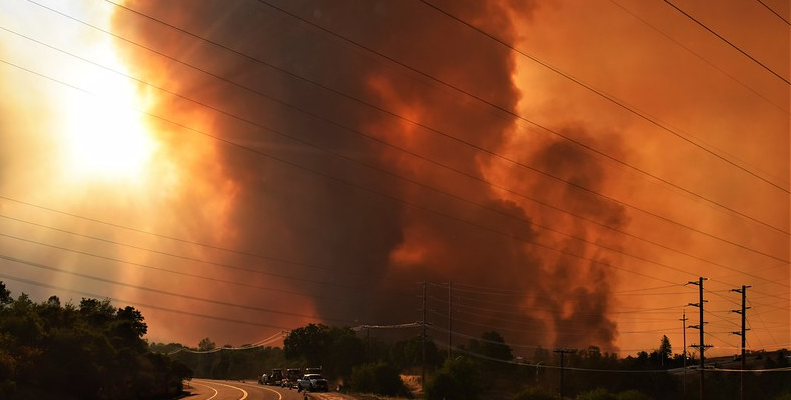

# Let's Stop Wildfires Hackathon

This hackathon is conducted by AI For Mankind. The goal is to come up with ideas to help solve California wildfires crisis and we believe that open sharing and collaboration are important in accelerating innovation and driving meaningful change locally and globally. Public and private partnerships coupled with citizen participation can help win the fight against wildfires. Everything built during the hackathon will remain as open source with The MIT license. Special thanks to [FUEGO](https://fuego.ssl.berkeley.edu/what-is-fuego/) to provide guidances to make this hackathon possible.

**Note: If you wish to keep your idea/project private, please do not enter this hackathon.**

**To participate in the hackathon: Register [here](https://forms.gle/Rtedxr1rT9HHJogm6)**

Last day to register is Jan 31, 2020.

#### Contact Us
If you have any questions, please feel free to

Email us at [ai.for.mankind@gmail.com](ai.for.mankind@gmail.com) or

Join us on **Slack** at [https://tinyurl.com/rrsflyv](https://tinyurl.com/rrsflyv)

By participating in this hackathon, participants agree to be bound by all of the terms and conditions as set out below.

#### Eligibility

1. This hackathon is open to everyone at least 18 years old and live in the United States.

#### Hackathon Period
The hackathon starts on Oct 16, 2019 at 5PM PT and ends on Feb 23, 2020 at 11:59PM PT. 

Note: Hackathon end dates are at the sole discretion of AI For Mankind and may be subject to change.

#### Requirements
1. Teams must be comprised of 1-5 people.

2. You have to create a public github repository for your entry with the MIT License.

3. Participants are not allowed to enter in projects containing confidential information or subject to the proprietary rights of any person or entity.

#### How Will My Entry be Potentially Used?

By participating in the hackathon, you agree to ALL of the following statements:

1. You understand and acknowledge that your entry/submission in their entirety will become open source (MIT License) and made publicly available to everyone. You agree to make any code produced/submitted for the hackathon (your entry’s github repository) available under the terms of The MIT License and other created works under the terms of the CC BY-SA 4.0 licence. **Participant hereby irrevocably licenses all Work Product under the MIT License located at https://opensource.org/licenses/MIT.** "Work Product" means all ideas, concepts, proposals, materials, and all other work product of any nature whatsoever, that are created, prepared, produced, conceived, or reduced to practice by Participant solely or jointly with others during the Hackathon. Participant represents and warrants that, to the best of his or her knowledge, the Work Product is and will be Participant’s own original work and does not and will not infringe the intellectual property or proprietary rights of any third party, including, without limitation, any third party patents, copyrights or trademarks.

2. You understand and acknowledge that after the submission deadline has passed, your project (github repository) that has been submitted to the hackathon cannot be deleted or made private.  Your project repository will also be featured on the AI For Mankind Let's Stop Wildfires hackathon github page after the hackathon has concluded.
3. You understand and acknowledge that others may have developed or commissioned materials similar or identical to your entry and you waive any claims you may have resulting from any similarities to your entry.
4. You understand that you will not receive any compensation for use of your entry.
 
Note: If you do not agree to above and want to keep your idea/project private, please do not enter this hackathon.

#### Rules of Conduct
1. Respect each other.
2. Do not violate copyrights, trademarks, or other such rights.
3. Observe data protection legislation.

Note: Teams can be disqualified from the competition at the organizer's discretion. Reasons might include but are not limited to breaking the Hackathon Rules or other unsporting behavior.

#### References
1. [The MIT License](https://opensource.org/licenses/MIT)
2. [CC BY-SA 4.0 Licence](https://creativecommons.org/licenses/by/4.0/)

#### Wildfire Smoke Detection Challenge
We launched these Wildfire Smoke Detection Challenge IA, IB and II in conjunction of the **Let’s Stop Wildfires Hackathon**. 
You can use your solution as the entry to the Let's Stop Wildfire Hackathon. 

Learn more about
- [Challenge IA: Smoke vs No Smoke using entire image](wildfire_smoke_challenge_1A.md)
- [Challenge IB: Smoke vs No Smoke using gridded image](wildfire_smoke_challenge_1B.md)
- [Challenge II: Start of Smoke Ignition](wildfire_smoke_challenge_2.md)

#### Mentors for Hackathon
1. [Adam Kraft](https://www.linkedin.com/in/adam-kraft-7555b534/) Machine Learning Engineer from Google Brain
2. [Anna Bethke](https://www.linkedin.com/in/annabethke/), Head of AI for Social Good for Intel
3. [Jianming Zhang](https://www.linkedin.com/in/jianming-zhang-60762227/), Senior Research Scientist from Adobe Research
4. [Jigar Doshi](https://www.linkedin.com/in/jigarkdoshi/), Machine Learning Lead from [CrowdAI](https://crowdai.com/)
5. [Kinshuk Govil](https://www.linkedin.com/in/kinshuk-govil-0080522/), Lead for Machine Learning based early wildfire detection system with [FUEGO](https://fuego.ssl.berkeley.edu/what-is-fuego/)
6. [Tim Ball](https://www.linkedin.com/in/tim-ball-1832a824/), President of [Fireball International](http://www.fireballit.com/)
7. [Vladimir Iglovikov](https://www.linkedin.com/in/iglovikov/) Kaggle Grandmaster, Senior Computer Vision Engineer at Level5, Self-Driving Division, Lyft Inc.

#### Quick Start
Checkout the following resources to get you started

1. HPWREN Camera [Datasets](https://github.com/aiformankind/wildfire-smoke-dataset)

2. [Google Colaboratory to develop deep learning application on free GPU](https://colab.research.google.com)

3. Tensorflow based [Wildfire Smoke Classifier](https://github.com/aiformankind/wildfire-smoke-classifier-camera)

4. Tensorflow based [Wildfire Smoke Detector](https://github.com/aiformankind/wildfire-smoke-detection-camera)

5. [FUEGO firecam repo](https://github.com/fuego-dev/firecam)

#### Wildfire Resources
1. [FUEGO Wildfire Detection Slides by Kinshuk Govil](https://tinyurl.com/yyo2b6qv)
2. [Wildland Fire Assessment System](http://www.wfas.net/)
3. [The United States Fourth National Climate Assessment Volume II](https://nca2018.globalchange.gov/downloads/NCA4_Report-in-Brief.pdf)
4. [How Wildfire Works](https://science.howstuffworks.com/nature/natural-disasters/wildfire.htm/printable)
5. [Fighting Wildfires](https://mentalfloss.com/article/57094/10-strategies-fighting-wildfires)

#### Tensorflow Resources
1. [Tensorflow Quickstart](https://www.tensorflow.org/tutorials/quickstart/beginner)
2. [Tensorflow Tutorials](https://www.tensorflow.org/tutorials)
3. [Install Tensorflow in PyCharm](https://youtu.be/vEXCMOuPB3c)
4. [What is transfer learning? Exploring the popular deep learning approach](https://builtin.com/data-science/transfer-learning) 
5. [Transfer learning in TensorFlow 2 tutorial](https://adventuresinmachinelearning.com/transfer-learning-tensorflow-2/)
6. [Deep learning unbalanced training data](https://towardsdatascience.com/deep-learning-unbalanced-training-data-solve-it-like-this-6c528e9efea6)

#### Papers
1. [Do Better ImageNet Models Transfer Better?](https://www.zpascal.net/cvpr2019/Kornblith_Do_Better_ImageNet_Models_Transfer_Better_CVPR_2019_paper.pdf)
2. [SpotTune: Transfer Learning through Adaptive Fine-tuning](http://openaccess.thecvf.com/content_CVPR_2019/papers/Guo_SpotTune_Transfer_Learning_Through_Adaptive_Fine-Tuning_CVPR_2019_paper.pdf)
3. [Taskonomy: Disentangling Task Transfer Learning](http://openaccess.thecvf.com/content_cvpr_2018/papers/Zamir_Taskonomy_Disentangling_Task_CVPR_2018_paper.pdf)

#### Events
1. [RSVP to join upcoming Let's Stop Wildfires Onsite Hackathon on Saturday, Jan 11, 2020 at Insight Data Science, San Francisco](https://www.meetup.com/AI-for-Mankind/events/266419523/)
